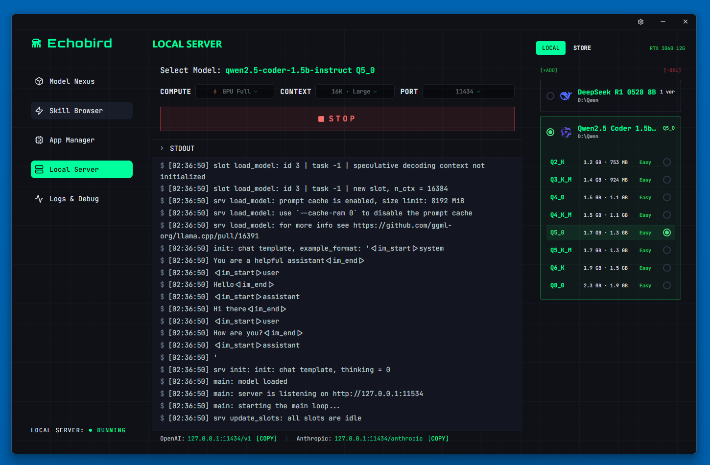
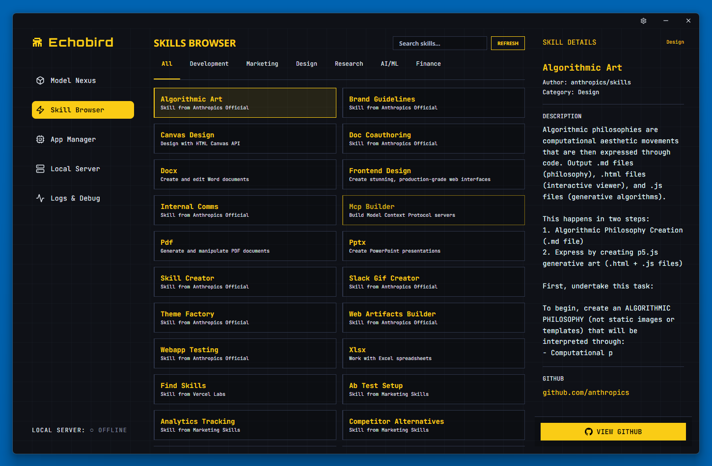

<p align="center">
  
</p>

<h1 align="center">Echobird</h1>

<p align="center">
  Le Nexus pour les Modèles, les Agents et le Vibe Coding.<br/>
  <sub>Un panneau de contrôle cyberpunk pour l'ère de l'IA — construit avec Tauri + Rust.</sub>
</p>

<p align="center">
  <a href="https://github.com/edison7009/Echobird-MotherAgent/releases">
    
  </a>
  
  
</p>

<p align="center">
  <a href="../README.md">English</a> ·
  <a href="./README.zh-CN.md">简体中文</a> ·
  <a href="./README.zh-TW.md">繁體中文</a> ·
  <a href="./README.ja.md">日本語</a> ·
  <a href="./README.ko.md">한국어</a> ·
  <a href="./README.es.md">Español</a> ·
  <strong>Français</strong> ·
  <a href="./README.de.md">Deutsch</a> ·
  <a href="./README.pt.md">Português</a> ·
  <a href="./README.ru.md">Русский</a> ·
  <a href="./README.ar.md">العربية</a>
</p>

---

## 🤖 MotherAgent — Déployez des modèles. Lancez des agents.

**MotherAgent** est votre agent IA autonome — déployez des LLMs locaux, connectez des modèles distants et lancez OpenClaw depuis un seul endroit.

- 🖥️ **Déploiement LLM Local** — Un clic pour déployer Qwen, DeepSeek, Llama via llama.cpp intégré. Vos données ne quittent jamais votre appareil.
- 🌐 **LLM Distant** — Connectez OpenAI, Anthropic, Google Gemini ou tout endpoint OpenAI-compatible instantanément.
- 🦅 **Déployer OpenClaw** — Lancez et gérez les agents OpenClaw directement depuis MotherAgent. Sans terminal.
- 💾 **Sessions Persistantes** — Les conversations de l'agent survivent au redémarrage. Reprenez exactement où vous en étiez.
- ⚡ **Tout Protocole** — OpenAI API et Anthropic API. Changez de protocole par agent sans toucher la config.

---

## ✨ Echobird — Changez de modèle. Pas de fichiers config.

Echobird est le **panneau de contrôle visuel** pour tous vos outils IA. Pointez, cliquez, changez.

- 🎯 **Changement en Un Clic** — Configurez visuellement les modèles IA pour n'importe quel outil. Fini l'édition JSON.
- 🔀 **Double Protocole** — OpenAI & Anthropic API. Changez à tout moment.
- 🚇 **Proxy Tunnel** — APIs géo-restreintes sans VPN complet.
- 🧩 **Navigateur de Skills** — Découvrez et installez des compétences IA sur plusieurs outils.
- 🎮 **Apps IA** — Reversi, AI Translate. D'autres à venir.
- 🌍 **28 Langues** — Internationalisation complète pour les développeurs du monde entier.

---

## 🖼️ Captures d'Écran

### Model Nexus — Gérez tous vos modèles IA en un endroit


### App Manager — Changement de modèle en un clic pour tous les outils


### Local Server — Exécutez des modèles open-source localement avec llama.cpp


### Skill Browser — Découvrez et installez des compétences IA


---

## 🚀 Télécharger

| Plateforme | Téléchargement |
|-----------|----------------|
| 🪟 Windows | [Echobird-x64-setup.exe](https://github.com/edison7009/Echobird-MotherAgent/releases/latest) |
| 🍎 macOS (Apple Silicon) | [Echobird_aarch64.dmg](https://github.com/edison7009/Echobird-MotherAgent/releases/latest) |
| 🍎 macOS (Intel) | [Echobird_x64.dmg](https://github.com/edison7009/Echobird-MotherAgent/releases/latest) |
| 🐧 Linux | [Echobird_amd64.AppImage](https://github.com/edison7009/Echobird-MotherAgent/releases/latest) |

**Démarrage rapide Linux :**
```bash
chmod +x Echobird_*.AppImage
./Echobird_*.AppImage
# Erreur FUSE ? sudo apt install libfuse2
```

---

## 🔧 Compatible Avec

| Outil | Protocole |
|-------|----------|
| OpenClaw | OpenAI / Anthropic |
| Claude Code | Anthropic |
| Cline | OpenAI |
| Roo Code | OpenAI |
| Continue | OpenAI |
| OpenCode | OpenAI |
| Codex | OpenAI |
| Aider | OpenAI / Anthropic |
| ZeroClaw | OpenAI |

---

## 🏗️ Stack Technique

**Tauri 2** + **Rust** + **React** + **TypeScript** + **llama.cpp**

---

## 📬 Contact

- 📧 [hi@echobird.ai](mailto:hi@echobird.ai)
- 🌐 [echobird.ai](https://echobird.ai)

---

<p align="center">
  Fait avec 💚 par l'équipe Echobird<br/>
  <sub>⭐ <a href="https://github.com/edison7009/Echobird-MotherAgent">Étoilez sur GitHub</a> — ça aide les autres à découvrir le projet !</sub>
</p>
