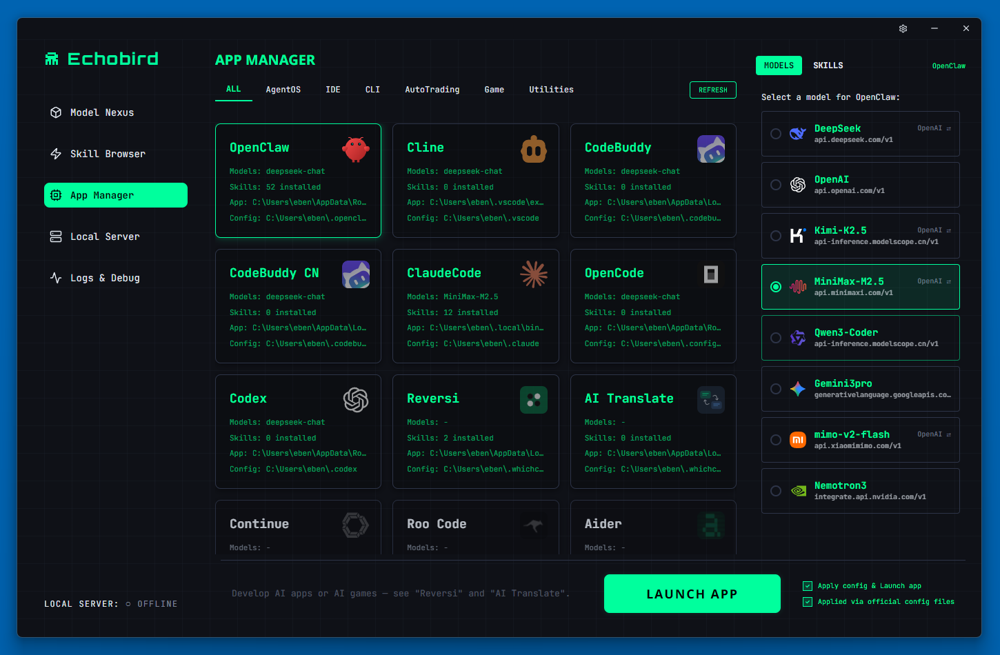
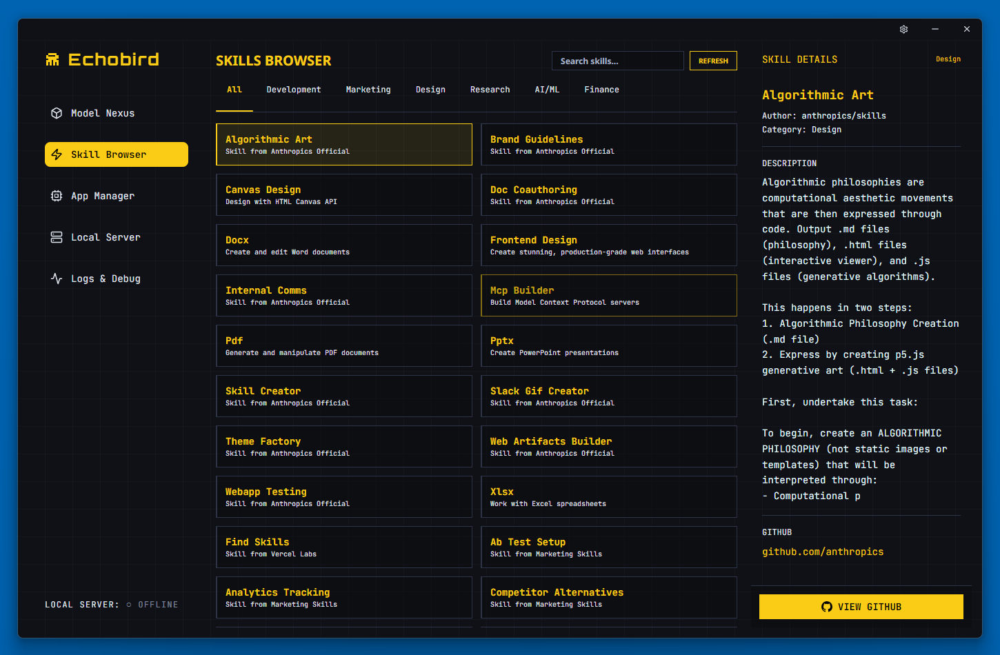

<p align="center">
  
</p>

<h1 align="center">Echobird</h1>

<p align="center">
  The Nexus for <strong>Models</strong>, <strong>Agents</strong> & <strong>Vibe Coding</strong>.<br/>
  <sub>Echobird は、AIコーディングツール全体でモデルを管理するためのビジュアルで統一されたインターフェースを提供するデスクトップアプリです。</sub>
</p>

<p align="center">
  <a href="https://github.com/edison7009/Echobird/releases">
    
  </a>
  
  
</p>

<p align="center">
  <a href="../README.md">English</a> · <a href="./README.zh-CN.md">简体中文</a> · <a href="./README.zh-TW.md">繁體中文</a> · **日本語** · <a href="./README.ko.md">한국어</a>
</p>

---

## ✨ Echobird とは？

Echobird は、AIコーディングツール全体でモデルを管理するための**ビジュアルで統一されたインターフェース**を提供するデスクトップアプリです。

### 課題

- 😫 OpenClaw などのツールでAIモデルを切り替えるには設定ファイルの手順が必要
- 🔄 各ツールが独自のモデル設定形式を持っている
- 🧩 ツール間でスキルや拡張機能を管理する方法がない

### ソリューション

Echobird はすべてのAIコーディングツールの**中央コントロールパネル**として機能します：

- 🎯 **ワンクリックモデル切替** — 対応ツールのAIモデルをビジュアルに切り替え
- 🔀 **デュアルプロトコル** — OpenAI & Anthropic API対応
- 🚇 **スマートトンネルプロキシ** — フルVPNなしで地域制限APIにアクセス
- 🧩 **スキルブラウザ** — AIスキルを発見、インストール、管理
- 🖥️ **ローカル模型サーバー** — llama.cpp経由でオープンソースモデルをローカル実行
- 🌍 **28言語対応** — グローバル対応の完全国際化
- 🎮 **内蔵AIアプリ** — Reversi やAI翻訳などのインタラクティブなAIゲーム
- 🌃 **サイバーパンク UI** — ネオングリーンのターミナル美学

## 🖼️ スクリーンショット

### Model Nexus — すべてのAIモデルを一箇所で管理


### App Manager — ワンクリックでモデル切替


### Local Server — オープンソースモデルをローカル実行


### Skill Browser — スキルを発見・インストール


## 🚀 クイックスタート

### ダウンロード

最新リリースを入手：

| プラットフォーム | ダウンロード |
|----------|----------|
| Windows  | [Echobird-Setup.exe](https://github.com/edison7009/Echobird/releases/latest) |
| macOS    | [Echobird.dmg](https://github.com/edison7009/Echobird/releases/latest) |
| Linux    | [Echobird.AppImage](https://github.com/edison7009/Echobird/releases/latest) |

### Linux の注意事項

```bash
chmod +x Echobird-*.AppImage
./Echobird-*.AppImage
```

> FUSE エラーが発生した場合： `sudo apt install libfuse2`

## 🔧 対応ツール

| ツール | ステータス | モデル切替 | プロトコル |
|------|--------|----------------|----------|
| OpenClaw | ✅ 対応済み | ✅ | OpenAI / Anthropic |
| Claude Code | ✅ 対応済み | ✅ | Anthropic |
| Cline | ✅ 対応済み | ✅ | OpenAI |
| Continue | ✅ 対応済み | ✅ | OpenAI |
| OpenCode | ✅ 対応済み | ✅ | OpenAI |
| Codex | ✅ 対応済み | ✅ | OpenAI |
| Roo Code | ✅ 対応済み | ✅ | OpenAI |

## 🏗️ 技術スタック

- **Electron** — デスクトップフレームワーク
- **React + TypeScript** — UIフレームワーク
- **Vanilla CSS** — デザインシステム
- **Vite** — 构建工具
- **llama.cpp** — 推論エンジン

## 🛠️ 開発

```bash
npm install
npm run dev
npm run build
```

## 🤝 コントリビュート

コントリビュート大歓迎！

We're especially looking for help with:
- 🍎 **macOS 测试**
- 🔧 **新工具集成**
- 🌐 **翻译改进**

## ⭐ サポート

Echobird が役立ったら、GitHub で ⭐ をお願いします！

## 📄 ライセンス

[MIT](../LICENSE)

---

<p align="center">
  Echobird チームが 💚 を込めて制作<br/>
  <sub>📧 <a href="mailto:hi@echobird.ai">hi@echobird.ai</a></sub>
</p>
