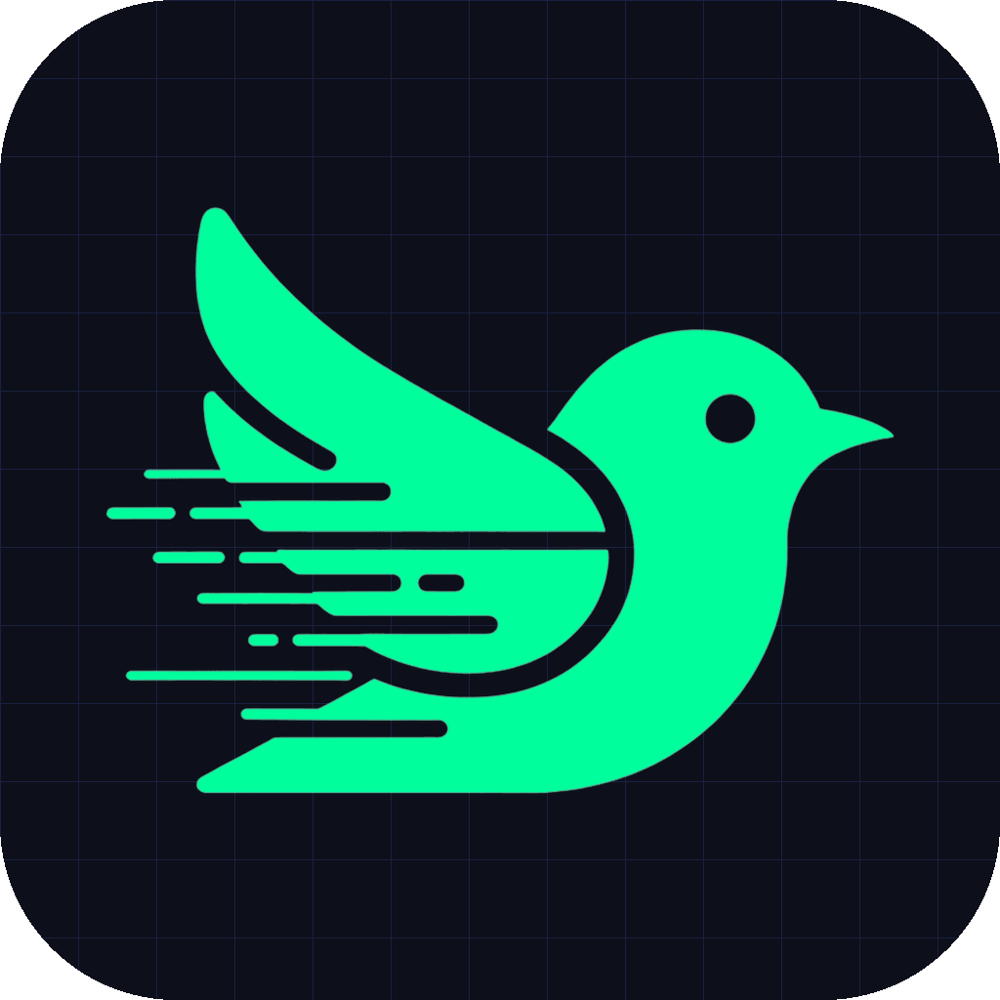
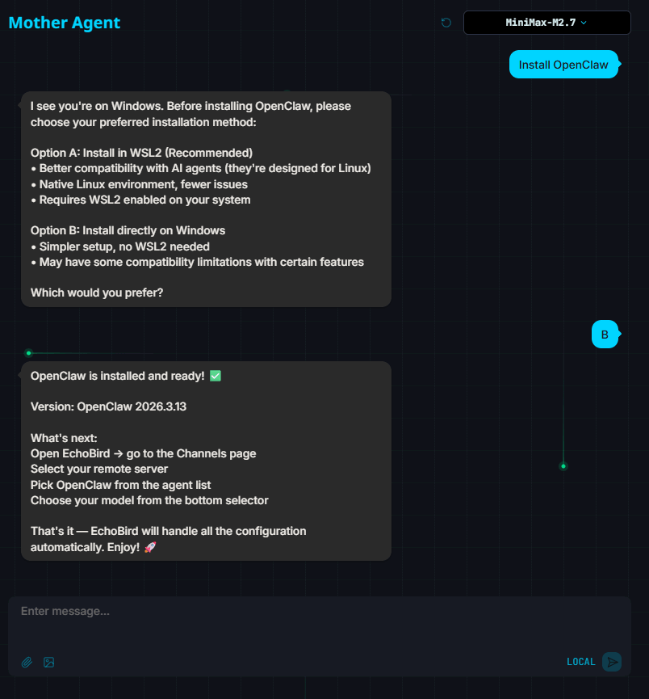
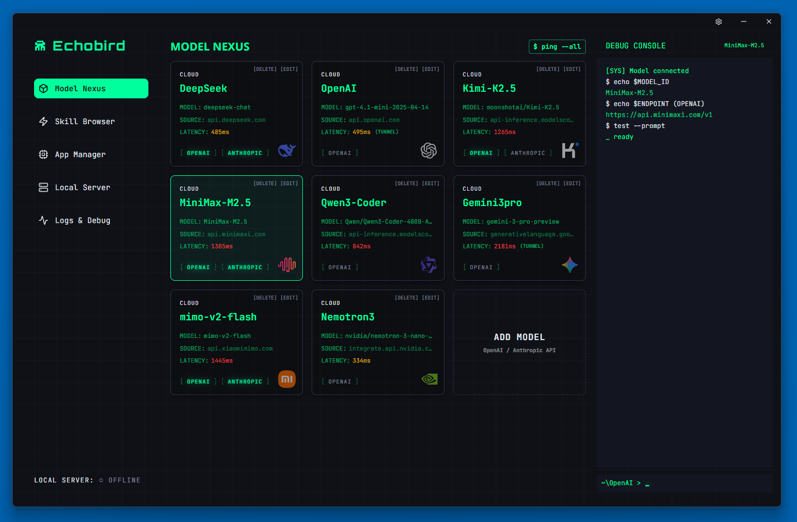
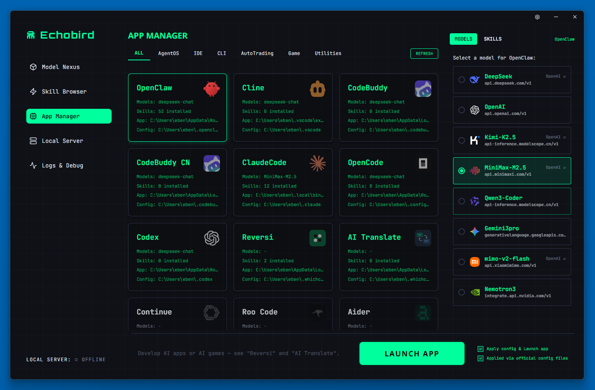
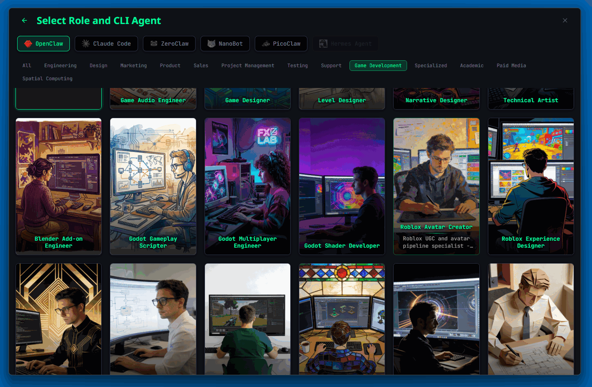

<p align="center">
  
</p>

<h1 align="center">EchoBird</h1>

<h3 align="center">Развертывайте ИИ-агентов как профи — без терминала, без конфигурации, в один клик.</h3>

<p align="center">
  Устанавливайте OpenClaw, Claude Code, ZeroClaw и другие в один клик · Свободно переключайте модели на локальных серверах · Управляйте всеми агентами на одном экране.
</p>

<p align="center">
  <a href="https://github.com/edison7009/Echobird-MotherAgent/releases">
    
  </a>
  
  
</p>

<p align="center">
  <a href="../README.md">English</a> ·
  <a href="./README.zh-CN.md">简体中文</a> ·
  <a href="./README.zh-TW.md">繁體中文</a> ·
  <a href="./README.ja.md">日本語</a> ·
  <a href="./README.ko.md">한국어</a> ·
  <a href="./README.es.md">Español</a> ·
  <a href="./README.fr.md">Français</a> ·
  <a href="./README.de.md">Deutsch</a> ·
  <a href="./README.pt.md">Português</a> ·
  <strong>Русский</strong> ·
  <a href="./README.ar.md">العربية</a>
</p>

---

## Почему EchoBird?

Даже если вы новичок в ИИ, EchoBird позволяет управлять собственным Agent — от установки до работы — через простой чат. Без опыта работы с терминалом, без конфигурационных файлов, без сложного развёртывания.

Хотите использовать **OpenClaw**, **Claude Code**, **ZeroClaw** или **Codex**? Один клик для установки. Запустить **Qwen**, **DeepSeek** или **Llama** на своём компьютере? Один клик для развёртывания. Переключить модель или добавить навыки? Нажмите — готово.

**EchoBird — одно приложение для всего** — установка агентов, переключение моделей, развёртывание LLM и управление всеми агентами с одного экрана — будь вы разработчик или новичок в ИИ.

<p align="center">
  
</p>

---

## ✨ Функции

### 🚀 Установка в Один Клик — OpenClaw, Claude Code, OpenCode, ZeroClaw и другие

- **Автоматическое обнаружение и установка** — EchoBird обнаруживает установленные агенты и разворачивает недостающие одним кликом
- **Plug-and-play инструменты** — Поместите `plugin.json` в папку tools и всё работает. Без изменения кода
- **Встроенный лаунчер** — Запускайте любого поддерживаемого агента без терминала

### 🔀 Переключение Модели в Один Клик — Мгновенная смена модели для всех агентов

- **Визуальный Model Nexus** — Управляйте всеми ИИ-моделями (OpenAI, Anthropic, Gemini, DeepSeek, Ollama или любой пользовательский endpoint) в одной панели
- **Двойной протокол** — OpenAI API и Anthropic API. Переключайте по агенту без изменения конфигурации
- **Применение в один клик** — Выберите карточку модели, активируйте для любого агента. Без редактирования JSON, TOML или `.env`

### 💻 Развёртывание LLM в Один Клик — Запускайте Qwen, DeepSeek, Llama, MiniMax локально или удалённо

- **Локальный LLM** — Разворачивайте open-source модели через встроенный llama.cpp, vLLM или SGLang. Данные никогда не покидают устройство
- **Единый прокси** — Автоматически предоставляет endpoints OpenAI (`/v1`) и Anthropic (`/anthropic`). Подключайте любого агента мгновенно
- **Умное обнаружение GPU** — Автоматическое определение GPU NVIDIA и рекомендация оптимальных настроек

### 📡 Channels — Управление несколькими агентами с одного экрана

- **Мульти-агентные каналы** — Запускайте OpenClaw, ZeroClaw или любых Bridge-совместимых агентов параллельно
- **Локально и удалённо** — Локальные агенты через Bridge-протокол, удалённые через SSH-туннели. Один интерфейс, один опыт
- **Постоянные сессии** — Беседы агентов сохраняются после перезапуска. Продолжайте с того места, где остановились
- **MotherAgent** — Ваш автономный ИИ-агент с tool calling, системой навыков и полной гибкостью моделей

### 🧩 Дополнительные встроенные функции

- 🌐 **Умный туннельный прокси** — Доступ к гео-ограниченным API без полного VPN
- 🎯 **Браузер навыков** — Находите, переводите и устанавливайте ИИ-навыки одним кликом
- 🎮 **Встроенные ИИ-приложения** — Reversi, AI Translate и другие
- 🌍 **28 языков** — Полная интернационализация от английского до арабского

---

## 🖼️ Скриншоты

### Model Nexus — OpenAI, Anthropic, Gemini, DeepSeek, Ollama — всё в одной панели


### App Manager — Переключение модели одним кликом для OpenClaw, Claude Code, Codex и других


### Локальный LLM — Разворачивайте Qwen, Llama, DeepSeek локально через llama.cpp / vLLM / SGLang


### Channels — Управление несколькими агентами с одного экрана


---

## 🚀 Скачать

| Платформа | Скачать |
|-----------|---------|
| 🪟 Windows | [Echobird-x64-setup.exe](https://github.com/edison7009/Echobird-MotherAgent/releases/latest) |
| 🍎 macOS (Apple Silicon) | [Echobird_aarch64.dmg](https://github.com/edison7009/Echobird-MotherAgent/releases/latest) |
| 🍎 macOS (Intel) | [Echobird_x64.dmg](https://github.com/edison7009/Echobird-MotherAgent/releases/latest) |
| 🐧 Linux | [Echobird_amd64.AppImage](https://github.com/edison7009/Echobird-MotherAgent/releases/latest) |

**Быстрый старт Linux:**
```bash
chmod +x Echobird_*.AppImage
./Echobird_*.AppImage
# Нужен FUSE? sudo apt install libfuse2
```

---

## 🔧 Совместим с

### Агенты и инструменты программирования

| Инструмент | Протокол | Установка |
|------------|----------|-----------|
| OpenClaw | OpenAI / Anthropic | Один клик |
| Claude Code | Anthropic | Один клик |
| OpenCode | OpenAI | Один клик |
| ZeroClaw | OpenAI | Один клик |
| NanoBot | OpenAI / Anthropic | Один клик |
| PicoClaw | OpenAI / Anthropic | Один клик |
| Hermes Agent | OpenAI / Anthropic | Один клик |
| Codex | OpenAI | Один клик |
| Cline | OpenAI | Конфиг |
| Roo Code | OpenAI | Конфиг |
| Continue | OpenAI | Конфиг |
| Aider | OpenAI / Anthropic | Конфиг |

### Локальные LLM-рантаймы

| Рантайм | Модели | Платформа |
|---------|--------|-----------|
| llama.cpp | Qwen 3.5, Llama 4, DeepSeek, MiniMax M2.5, GLM-5 (GGUF) | Windows / macOS / Linux |
| vLLM | Любая модель HuggingFace | Linux (CUDA) |
| SGLang | Любая модель HuggingFace | Linux (CUDA) |

---

## 🏗️ Технологический стек

**Tauri 2** + **Rust** + **React** + **TypeScript** + **llama.cpp**

---

## 📬 Контакты

- 📧 [hi@EchoBird.ai](mailto:hi@EchoBird.ai) (Bug Reports)
- 🌐 [EchoBird.ai](https://echobird.ai)

---

<p align="center">
  <em>Последний интерфейс перед эпохой ИИ.</em><br/>
  Сделано с 💚 командой EchoBird<br/>
  <sub>⭐ <a href="https://github.com/edison7009/Echobird-MotherAgent">Star на GitHub</a> — помогите другим найти этот проект!</sub>
</p>
